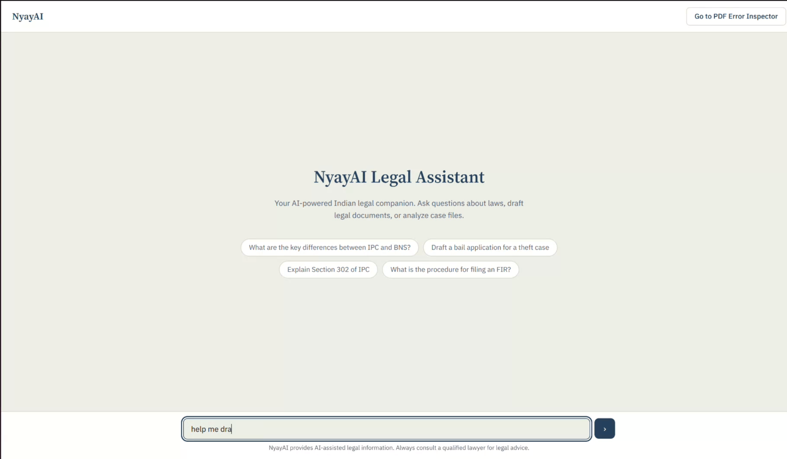
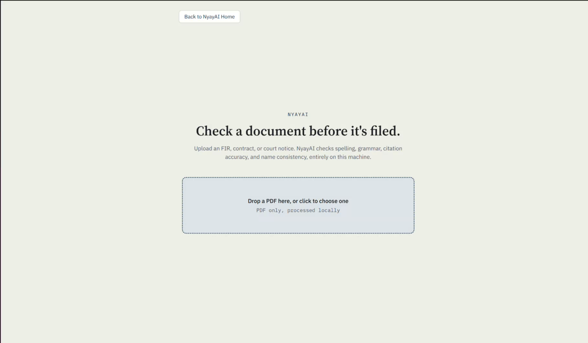
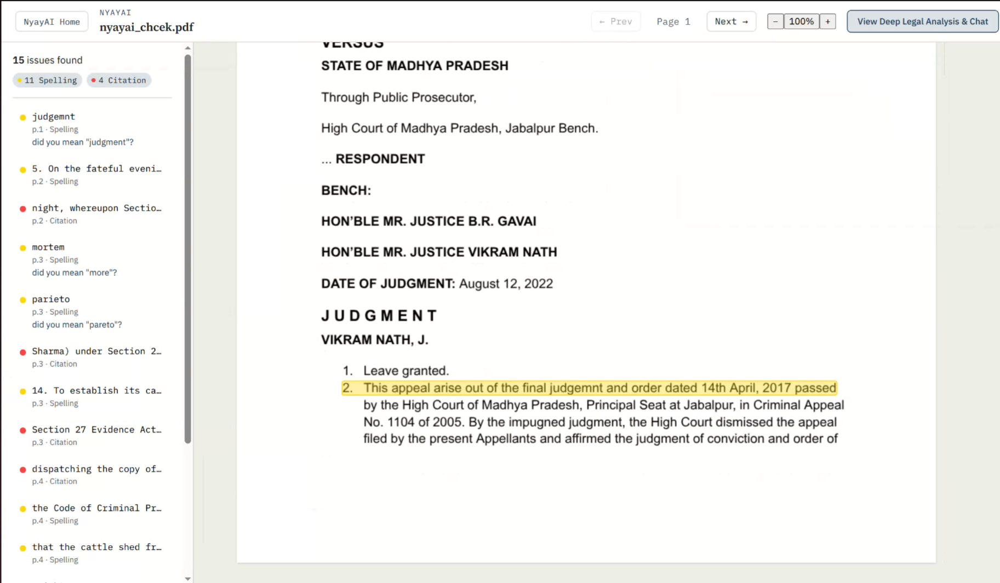
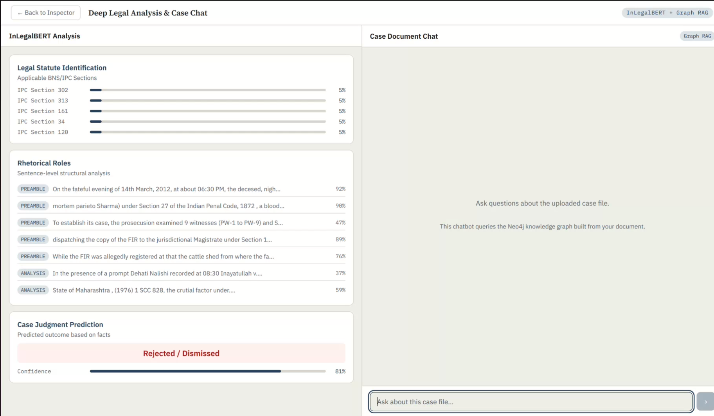

# NyayAI -- AI-Powered Legal Document Audit System for Indian Law

## Table of Contents

- [The Problem](#the-problem)
- [What NyayAI Does](#what-nyayai-does)
- [Interface](#interface)
- [System Architecture](#system-architecture)
- [Project Structure](#project-structure)
- [Prerequisites](#prerequisites)
- [Installation](#installation)
- [Model and Data Setup (DVC)](#model-and-data-setup-dvc)
- [Environment Configuration](#environment-configuration)
- [Running the Application](#running-the-application)
- [Model Training](#model-training)
- [Running the Test Suite](#running-the-test-suite)
- [Technical Deep Dive](#technical-deep-dive)
- [Dependency Matrix](#dependency-matrix)
- [API Reference](#api-reference)
- [Known Limitations](#known-limitations)
- [References](#references)
- [License](#license)

---

## The Problem

India's legal system generates an enormous volume of documents every day -- First Information Reports (FIRs), charge sheets, bail applications, court orders, and contracts. These documents are frequently drafted under time pressure, often by personnel without formal legal drafting training. The consequences of errors in these documents are severe:

- **Misspelled statutes and incorrect section numbers** can lead to charges being dropped or cases being dismissed. An FIR citing "Section 302 of IPC" when the offence falls under the Bharatiya Nyaya Sanhita (BNS) post-2024 creates a jurisdictional ambiguity that defence counsel can exploit.
- **Entity inconsistencies** -- a complainant's name spelled three different ways across a single FIR, or a location name that changes between the complaint and the witness statement -- undermine the evidentiary value of the entire document.
- **Cross-reference errors** -- "as stated in paragraph 7" when the document only has 5 paragraphs, or a schedule reference that points to a repealed section -- create internal contradictions that weaken legal arguments.
- **Grammar and spelling errors** in court orders and legal notices, while not always legally fatal, erode institutional credibility and can introduce genuine ambiguity in interpretation.

Existing tools fall short for Indian legal documents. General-purpose grammar checkers (Grammarly, LanguageTool) do not understand Indian legal terminology, statute numbering conventions, or the IPC-to-BNS transition. Commercial legal AI platforms are prohibitively expensive for district courts and legal aid organizations, and most require sending documents to external servers -- a non-starter for sensitive FIRs and ongoing investigations.

There is no widely available, privacy-preserving, Indian-law-aware tool that can audit a legal document end-to-end: from OCR extraction of scanned pages, through domain-specific error detection, to a structured, actionable report.

---

## What NyayAI Does

NyayAI is an end-to-end legal document audit system built specifically for Indian legal documents. It takes a PDF as input -- whether digitally generated or scanned -- and produces:

1. **An annotated PDF** with color-coded highlights marking every detected error directly on the original document layout.
2. **A structured error report** (JSON and HTML) categorizing each error by type (spelling, grammar, citation, entity inconsistency) with page numbers, bounding box coordinates, and where applicable, correction suggestions.
3. **Deep legal analysis** using InLegalBERT for Legal Statute Identification (LSI), Rhetorical Role classification (RR), and Court Judgment Prediction and Explanation (CJPE).
4. **A conversational legal assistant** powered by a Graph RAG pipeline that ingests the uploaded document into a Neo4j knowledge graph and answers questions grounded in the document's actual content.

**Everything runs locally.** No document content leaves the machine. The OCR engine (Surya), the error detection model (fine-tuned InLegalBERT), and the rule-based checkers all run on-device. The only external API calls are to Mistral AI for the optional Graph RAG entity extraction and to Neo4j Aura for the knowledge graph storage -- neither receives the raw document, only extracted entity-relationship triples.

The full pipeline has been verified end-to-end against real sample FIR documents: upload through the browser, OCR extraction, ML-based and rule-based error detection, merge/deduplicate/sort, annotated PDF rendering, and interactive result display in the frontend.

---

## Interface

<!-- 
  Replace the placeholder paths below with actual screenshots of the application.
  Recommended screenshots:
    1. Homepage / Legal Chatbot landing page
    2. PDF Upload page with progress indicator
    3. PDF Inspector view showing annotated errors with highlight overlay
    4. Deep Legal Analysis workspace (InLegalBERT results + Graph RAG chat)
-->

| View                              | Screenshot                                                |
| --------------------------------- | --------------------------------------------------------- |
| Homepage -- Legal Chatbot         |            |
| PDF Upload                        |                |
| PDF Error Inspector               |        |
| Deep Legal Analysis and Case Chat |  |

> **Note:** To add screenshots, save the images to `docs/images/` and update the paths above.

---

## System Architecture

```
                                    Browser (React + PDF.js)
                                           |
                              POST /upload, GET /status, GET /result
                              POST /analyze/*, POST /api/v1/chat/*
                                           |
                                    FastAPI (api/main.py)
                                    /            |            \
                             Upload+Poll    Analysis      Chat+Ingest
                             (api/routes/)  (InLegalBERT) (LangGraph Agent)
                                  |              |              |
                           Celery Worker    GPU Inference   Mistral + Neo4j
                           (--pool=solo)         |              |
                                  |         app.state      Graph RAG
                            +-----------+   .ml_models     (Neo4j Aura)
                            |           |
                       OCR Pipeline   Error Detection Pipeline
                       (ocr/)         (pipeline/engine.py)
                       |    |              |           |
                  Native  Surya       InLegalBERT   Rule-Based
                  (pdfplumber) (GPU)  (model/)      (rules/)
                                          |              |
                                     Fine-tuned     Citation + Entity
                                     Checkpoint     + Spelling + XRef
                                          |
                                    Merge / Deduplicate / Sort
                                          |
                                    Renderer (renderer/)
                                    |              |
                              Annotated PDF   JSON + HTML Report
```

The system comprises three independently runnable processes:

| Process                 | Command                                 | Purpose                                                                      |
| ----------------------- | --------------------------------------- | ---------------------------------------------------------------------------- |
| **API Server**    | `uvicorn api.main:app`                | HTTP endpoints, serves static files, preloads InLegalBERT models             |
| **Celery Worker** | `celery -A workers.celery_app worker` | Processes PDF analysis jobs asynchronously (OCR, error detection, rendering) |
| **Frontend**      | `npm run dev` (in `frontend/`)      | React SPA with PDF.js canvas, error overlay, and chat interface              |

Communication between the API server and the Celery worker uses a **filesystem broker** and **SQLite result backend** -- no Redis or RabbitMQ required.

---

## Project Structure

```
nyayai/
|-- ocr/                        Text extraction from PDFs
|   |-- tokens.py               LineSpan dataclass (line-level text + measured bounding box)
|   |-- native_extractor.py     pdfplumber-based extraction for digital PDFs
|   |-- surya_extractor.py      Surya OCR for scanned/image-only pages (GPU)
|   |-- router.py               Decides which extractor each page requires
|   +-- pipeline.py             Single extract() entry point
|
|-- model/                      InLegalBERT inference and fine-tuned checkpoint
|   |-- schemas.py              ErrorSpan dataclass + BIO label scheme
|   |-- preprocess.py           LineSpans to token chunks (512 tokens, sliding window)
|   |-- predict.py              Model inference with module-level GPU weight caching
|   |-- postprocess.py          BIO label sequences to ErrorSpans with bounding boxes
|   +-- checkpoint/             Fine-tuned model weights (tracked via DVC)
|
|-- rules/                      Rule-based error checkers
|   |-- citation_checker.py     Regex + corpus vector search for statute validation
|   |-- entity_checker.py       spaCy NER + rapidfuzz clustering for name consistency
|   |-- spelling_checker.py     Legal vocabulary-aware spell checker
|   |-- cross_reference_checker.py  Detects dangling internal references
|   +-- registry.py             Pluggable checker registry
|
|-- corpus/                     Indian legal statute corpus
|   |-- schemas.py, chunker.py, embeddings.py, uploader.py, search.py
|   |-- parser.py               Dispatcher for act-specific parsers
|   |-- parsers/                One parser per act (IPC, BNS, BNSS, CPC, CrPC, Constitution)
|   +-- data/                   IPC-to-BNS and CrPC-to-BNSS mapping tables
|
|-- pipeline/                   Orchestration: merge, deduplicate, reading-order sort
|-- renderer/                   Output generation: annotated PDF, JSON report, HTML report
|
|-- services/                   Backend business logic
|   |-- storage.py              Job-ID-based file layout for uploads and outputs
|   +-- analysis.py             Orchestrates: extract -> analyze -> render -> save
|
|-- workers/                    Celery configuration and task definitions
|   |-- celery_app.py           Filesystem broker + SQLite backend setup
|   |-- tasks.py                process_pdf task (thin wrapper over services/analysis.py)
|   +-- queues.py               Queue names and routing configuration
|
|-- api/                        FastAPI application
|   |-- main.py                 App entry point, lifespan (model preload), CORS, routing
|   |-- routes/                 upload, jobs, health, chat, analysis, debug
|   |-- schemas/                Pydantic request/response models
|   +-- services/               ML service, legal agent, Graph RAG, PDF-to-graph ingestion
|
|-- frontend/                   React SPA (Vite + PDF.js)
|   +-- src/
|       |-- App.jsx             Main application with three-view navigation
|       |-- api.js              API client for all backend endpoints
|       |-- PdfCanvas.jsx       PDF.js renderer
|       |-- HighlightOverlay.jsx  Error highlight layer
|       |-- ErrorList.jsx       Sidebar error listing
|       +-- components/         HomepageChat, AnalysisWorkspace, FormattedMessage
|
|-- train/                      Model training scripts
|-- config/                     Settings (pydantic-settings) and constants
|-- scripts/                    CLI utilities (corpus ingestion, data generation, cleanup)
|-- tests/                      Automated test suite (pytest)
|-- docs/                       Architecture and API documentation
|-- data/                       Runtime data directory (tracked via DVC)
|-- docker-compose.yml          Qdrant vector database service
+-- pyproject.toml              Python dependencies and project metadata
```

---

## Prerequisites

| Requirement             | Version                  | Notes                                                                                  |
| ----------------------- | ------------------------ | -------------------------------------------------------------------------------------- |
| **Python**        | 3.10                     | Pinned -- see[Dependency Matrix](#dependency-matrix) for version constraints            |
| **NVIDIA GPU**    | CUDA-capable, 6 GB+ VRAM | Tested on RTX 4050. Required for Surya OCR and InLegalBERT inference                   |
| **CUDA Toolkit**  | 12.4                     | Must match the PyTorch wheel specified in`pyproject.toml`                            |
| **Docker**        | 20.10+                   | Required for running the Qdrant vector database                                        |
| **Node.js**       | 20+                      | Required for the frontend development server                                           |
| **uv**            | Latest                   | Python package manager. Install via`curl -LsSf https://astral.sh/uv/install.sh \| sh` |
| **poppler-utils** | System package           | Required by`pdf2image` for PDF rendering                                             |
| **Git LFS / DVC** | DVC 3.67+                | For retrieving model weights and data artifacts                                        |

---

## Installation

### 1. Clone the Repository

```bash
git clone https://github.com/<your-org>/nyayai.git
cd nyayai
```

### 2. Create the Python Environment

```bash
uv venv
source .venv/bin/activate
uv sync
```

All dependency versions are pinned in `pyproject.toml`. Do not upgrade `transformers`, `surya-ocr`, or `torch` without reading the [Dependency Matrix](#dependency-matrix) -- there are known incompatibilities.

### 3. Install System Dependencies

```bash
sudo apt install poppler-utils
```

### 4. Download spaCy Language Model

```bash
uv run python -m spacy download en_core_web_sm
```

### 5. Verify GPU Access

```bash
python -c "import torch; print(torch.cuda.is_available(), torch.cuda.get_device_name(0))"
```

Expected output: `True <your GPU name>`. If this prints `False`, resolve the CUDA/driver configuration before proceeding. Both Surya OCR and InLegalBERT require a working GPU, and all batch sizes and worker pool settings are tuned with this assumption.

### 6. Start Qdrant

```bash
docker compose up -d qdrant
```

No Redis is required. Celery uses a filesystem broker and SQLite result backend instead.

### 7. Ingest the Legal Corpus (one-time)

```bash
uv run python scripts/ingest_corpus.py --all
```

This parses all six Indian legal acts (IPC, BNS, BNSS, CPC, CrPC, Constitution) and uploads their section embeddings to Qdrant for citation validation lookups.

### 8. Install Frontend Dependencies

```bash
cd frontend
npm install
cd ..
```

---

## Model and Data Setup (DVC)

The `data/` directory and the fine-tuned model checkpoint (`model/checkpoint/`) are too large for Git and are tracked with [DVC](https://dvc.org/) instead. The DVC metafiles (`data.dvc`, `model/checkpoint.dvc`) are committed to Git; the actual data is stored in a remote.

### Retrieving Models on a Fresh Clone

The DVC remote is configured as a Google Drive folder. To pull the model weights and data artifacts:

```bash
# Install DVC (included in project dependencies via uv sync)
# Pull all DVC-tracked files
dvc pull
```

On first run, DVC will prompt for Google Drive authentication to access the shared remote.

**DVC Remote Configuration** (already set in `.dvc/config`):

| Remote        | URL                                            | Purpose                                                                   |
| ------------- | ---------------------------------------------- | ------------------------------------------------------------------------- |
| `my-gdrive` | `gdrive://1hPB-Emu1POPk70RT6b66xI7mpYCIbjUl` | Shared Google Drive folder containing model checkpoint and data artifacts |

If you need to configure a different remote (for example, a local filesystem or S3 bucket):

```bash
# Point DVC to a local path
dvc remote modify local url /path/to/your/dvc-storage

# Or add a new remote
dvc remote add myremote s3://bucket-name/path
dvc remote default myremote
```

### What DVC Tracks

| Artifact              | DVC File                 | Size              | Contents                                               |
| --------------------- | ------------------------ | ----------------- | ------------------------------------------------------ |
| `model/checkpoint/` | `model/checkpoint.dvc` | ~436 MB (8 files) | Fine-tuned InLegalBERT weights, tokenizer, and config  |
| `data/`             | `data.dvc`             | Variable          | Uploads, outputs, training data, Celery broker/results |

### After a New Training Run

If you retrain the model, update the DVC tracking and push:

```bash
dvc add model/checkpoint
git add model/checkpoint.dvc
git commit -m "Update model checkpoint after retraining"
dvc push
git push
```

---

## Environment Configuration

Copy the example environment file and fill in your credentials:

```bash
cp .env.example .env
```

### Required Environment Variables

| Variable                   | Description                                           | Example                                |
| -------------------------- | ----------------------------------------------------- | -------------------------------------- |
| `RECOGNITION_BATCH_SIZE` | Surya OCR recognition batch size (tune for your VRAM) | `32`                                 |
| `DETECTOR_BATCH_SIZE`    | Surya OCR detection batch size                        | `4`                                  |
| `TORCH_DEVICE`           | PyTorch device                                        | `cuda`                               |
| `QDRANT_URL`             | Qdrant vector database URL                            | `http://localhost:6333`              |
| `MISTRAL_API_KEY`        | Mistral AI API key (for Graph RAG entity extraction)  | `your_key_here`                      |
| `NEO4J_URI`              | Neo4j Aura connection URI                             | `neo4j+s://xxxxx.databases.neo4j.io` |
| `NEO4J_USERNAME`         | Neo4j username                                        | `neo4j`                              |
| `NEO4J_PASSWORD`         | Neo4j password                                        | `your_password_here`                 |
| `NEO4J_DATABASE`         | Neo4j database name                                   | `neo4j`                              |
| `HF_TOKEN`               | Hugging Face access token (for model downloads)       | `hf_xxxxx`                           |

The Mistral and Neo4j credentials are only required for the Chat and Graph RAG features. The core PDF error detection pipeline works without them.

---

## Running the Application

Three processes must be running simultaneously:

### Terminal 1: API Server

```bash
source .venv/bin/activate
uvicorn api.main:app --reload --reload-dir api --reload-dir services --reload-dir workers
```

The server starts on `http://localhost:8000`. On startup, it preloads three InLegalBERT model variants (LSI, RR, CJPE) into GPU memory for the `/analyze/*` endpoints.

### Terminal 2: Celery Worker

```bash
source .venv/bin/activate
uv run celery -A workers.celery_app worker --loglevel=info -Q pdf_processing --pool=solo
```

**Important flags:**

- `-Q pdf_processing` is required. Without it, the worker does not listen on the correct queue and uploads will appear stuck indefinitely with no error message.
- `--pool=solo` is required. The default `prefork` pool forks one child per CPU core, and each child loads its own copy of InLegalBERT and Surya models onto the GPU. On a 6 GB card, two or three concurrent children are enough to exhaust VRAM. `--pool=solo` runs everything in a single process, one task at a time, which matches the single-GPU deployment target.

### Terminal 3: Frontend

```bash
cd frontend
npm run dev
```

Open `http://localhost:5173` in a browser. The frontend communicates with the API server at `http://localhost:8000` by default. To change this, set `VITE_API_BASE_URL` in `frontend/.env`.

### Application Workflow

1. **Homepage** -- A general legal chatbot (powered by LangGraph + Mistral) for Indian law Q&A.
2. **PDF Inspector** -- Upload a PDF. The system runs OCR, error detection (ML + rules), and renders an annotated PDF with an interactive error sidebar.
3. **Deep Legal Analysis** -- After inspection, view InLegalBERT analysis (LSI, RR, CJPE) alongside a context-aware chatbot that queries a knowledge graph built from the uploaded document.

---

## Model Training

The fine-tuned InLegalBERT checkpoint in `model/checkpoint/` was trained using the scripts in `train/`. The training pipeline:

1. **Synthetic data generation** -- Deliberately corrupts verified legal text with spelling, grammar, and citation errors to produce labeled training data in BIO format.
2. **Fine-tuning** -- Uses the HuggingFace `Trainer` API to fine-tune `law-ai/InLegalBERT` with a token classification head.
3. **Evaluation** -- Computes per-label precision, recall, and F1 on a held-out test split.

### Training Commands

```bash
# Step 1: Generate synthetic training data
uv run python scripts/generate_data.py --corpus corpus/sources/ --out data/training

# Step 2: Fine-tune InLegalBERT
uv run python -m train.train

# Step 3: Evaluate on test split
uv run python -m train.evaluate
```

Equivalent Make targets: `make generate-data`, `make train`, `make evaluate`.

### Training Notebooks

The model training was also conducted in cloud notebook environments for GPU access. The complete training source code, hyperparameter configurations, and training logs are available at:

<!-- 
  Replace these placeholder links with the actual notebook URLs.
  These should be publicly accessible so that reviewers can verify
  the training methodology and reproduce results.
-->

| Platform     | Link                                                                                                       | Description                                                              |
| ------------ | ---------------------------------------------------------------------------------------------------------- | ------------------------------------------------------------------------ |
| Google Colab | [Training Notebook](#https://colab.research.google.com/drive/1okrY3GGlGIzr29-JQqgth7AkAhBYgi7M?usp=sharing) | Full training pipeline with data generation, fine-tuning, and evaluation |
| Kaggle       | [Training Notebook](#https://www.kaggle.com/code/pryans/layer2-nyayai/)                                     | Alternative training environment with Kaggle GPU resources               |

> **Note:** Replace the placeholder links above with the actual URLs to your published training notebooks.

### Training Configuration

| Parameter           | Value                             | Notes                                                                                                 |
| ------------------- | --------------------------------- | ----------------------------------------------------------------------------------------------------- |
| Base model          | `law-ai/InLegalBERT`            | Pre-trained on Indian legal text (IIT Kharagpur)                                                      |
| Task                | Token classification (BIO scheme) | 9 labels: O, B-SPELLING, I-SPELLING, B-GRAMMAR, I-GRAMMAR, B-CITATION, I-CITATION, B-ENTITY, I-ENTITY |
| Max sequence length | 512 tokens                        | Sliding window with stride 128 for long documents                                                     |
| Checkpoint size     | ~436 MB                           | Weights + tokenizer + config                                                                          |

---

## Running the Test Suite

### Standard Test Run

```bash
pytest tests/ --ignore=tests/test_qdrant_live.py -v
```

The `test_qdrant_live.py` file is excluded by default because it is a live integration test against a running Qdrant instance. All other tests are fully mocked and require no GPU, no network, and no running services.

### Test Coverage

| Test File            | What It Tests                                            | Mocking Strategy                                  |
| -------------------- | -------------------------------------------------------- | ------------------------------------------------- |
| `test_rules.py`    | Citation, entity, spelling, and cross-reference checkers | Mocks corpus lookup and spaCy NER                 |
| `test_model.py`    | InLegalBERT preprocessing, inference, and postprocessing | Mocks tokenizer and model (no GPU)                |
| `test_pipeline.py` | Pipeline orchestration (merge, deduplicate, sort)        | Mocks ML and rules layers                         |
| `test_api.py`      | FastAPI endpoint contracts                               | Mocks Celery task dispatch                        |
| `test_ocr.py`      | Native PDF text extraction                               | Uses a small reportlab-generated sample PDF       |
| `test_parser.py`   | Corpus parsers against real act PDFs                     | No mocking -- parses actual PDFs (slow, ~4-5 min) |

### Fast Iteration (skip slow parser tests)

```bash
pytest tests/ --ignore=tests/test_qdrant_live.py --ignore=tests/test_parser.py -v
```

### Manual OCR Smoke Test

For visual verification against a real scanned document (not part of automated suite):

```bash
make test-ocr FILE=path/to/scanned_document.pdf
```

### Live Qdrant Integration Test

Requires a running, ingested Qdrant instance:

```bash
docker compose up -d qdrant
uv run python scripts/ingest_corpus.py --all
pytest tests/test_qdrant_live.py -v
```

---

## Technical Deep Dive

### Async Job Processing Without Redis

Celery requires a message broker and a result backend. Instead of running Redis, NyayAI configures:

- **Broker:** Kombu's filesystem transport. A queued task is a file written to `data/celery/broker/out/`; the worker picks it up from there.
- **Result Backend:** SQLite via SQLAlchemy (`db+sqlite:///data/celery/results.sqlite`).

Both are local files with zero infrastructure overhead. To scale beyond a single machine, swap the broker URL to `redis://` or `amqp://` -- nothing in `workers/` or `api/` is coupled to the filesystem transport.

**Critical implementation detail:** All broker and result backend paths must be **absolute**, anchored to a fixed project root. The API server and Celery worker are launched as separate processes and do not share a working directory. Relative paths cause tasks to be written to one directory while the worker watches another -- no error, no crash, just tasks stuck "queued" indefinitely.

### GPU Memory Management

The system loads approximately 1.2 GB of model weights onto the GPU:

| Model                                   | Size    | Loading Strategy                            |
| --------------------------------------- | ------- | ------------------------------------------- |
| Surya Detection (`vikp/surya_det3`)   | ~400 MB | Module-level cache, loaded once per process |
| Surya Recognition (`vikp/surya_rec2`) | ~400 MB | Module-level cache, loaded once per process |
| InLegalBERT (fine-tuned)                | ~436 MB | Module-level cache, loaded once per process |

All three models use **process-wide singleton caches** so that a Celery worker processing many documents over its lifetime pays the model-load cost only once. Without this, each document would reload all weights, and back-to-back processing could exhaust VRAM before the previous instance was garbage collected.

### OCR Pipeline

The OCR system uses a two-path approach:

1. **Native extraction** (pdfplumber) for pages with an embedded text layer -- fast, exact bounding boxes.
2. **Surya OCR** for scanned/image-only pages -- GPU-accelerated, handles Hindi script, line-level bounding boxes.

The router (`ocr/router.py`) examines each page and decides which extractor to use based on character count, line count, and scanned-page indicators. Pages are processed in chunks to manage VRAM, with explicit memory cleanup between chunks.

### Error Detection Pipeline

Errors are detected by two independent systems that are merged and deduplicated:

1. **ML-based detection** (InLegalBERT): The document text is chunked into 512-token windows with a stride of 128. Each chunk is classified with a BIO token classification head. The postprocessor converts BIO label sequences back to ErrorSpans with the original bounding box coordinates.
2. **Rule-based detection**: Four pluggable checkers registered in `rules/registry.py`:

   - **Citation Checker:** Validates statute references against the Qdrant corpus using regex extraction and vector similarity search.
   - **Entity Checker:** Uses spaCy NER to extract person/location/organization entities and rapidfuzz clustering to detect inconsistent spellings of the same entity across the document.
   - **Spelling Checker:** Legal vocabulary-aware spell checking that avoids false positives on domain-specific terms.
   - **Cross-Reference Checker:** Detects dangling internal references ("see paragraph N" where paragraph N does not exist).

The merge step combines ML and rule-based errors, and the deduplication step removes overlapping detections. The final output is sorted in reading order (page, then top-to-bottom, then left-to-right).

---

## Dependency Matrix

These versions are pinned in `pyproject.toml` due to known incompatibilities. Do not upgrade without testing.

| Package                              | Version               | Reason for Pinning                                                                      |
| ------------------------------------ | --------------------- | --------------------------------------------------------------------------------------- |
| `torch`                            | `2.4.0+cu124`       | Matched to`transformers==4.48.0` and CUDA 12.4 toolkit                                |
| `transformers`                     | `4.48.0`            | Versions newer than 4.48.0 break Surya's`SuryaOCRConfig` with `KeyError: 'encoder'` |
| `surya-ocr`                        | `0.9.3`             | Surya 0.20+ requires a separate vLLM server; 0.9.3 is self-contained                    |
| `qdrant-client`                    | `1.17.1`            | Must stay within one minor version of the Qdrant server image                           |
| `fastapi`                          | `0.115.0`           | API framework                                                                           |
| `celery`                           | `5.4.0`             | Async job queue with filesystem broker + SQLite backend                                 |
| `pydantic` / `pydantic-settings` | `2.8.2` / `2.5.2` | Settings management and request/response schemas                                        |

### Frontend Dependencies

| Package        | Version      |
| -------------- | ------------ |
| `react`      | `^19.2.7`  |
| `pdfjs-dist` | `^6.1.200` |
| `vite`       | `^8.1.4`   |

Full dependency lists are in `pyproject.toml` (Python) and `frontend/package.json` (JavaScript).

---

## API Reference

### Core OCR Error Detection Flow

| Endpoint             | Method | Description                                                               |
| -------------------- | ------ | ------------------------------------------------------------------------- |
| `/upload`          | POST   | Upload a PDF for processing. Returns`{ job_id }`                        |
| `/status/{job_id}` | GET    | Poll processing status. Returns`{ status }` (PENDING, SUCCESS, FAILURE) |
| `/result/{job_id}` | GET    | Retrieve the error report, annotated PDF URL, and HTML report URL         |
| `/health`          | GET    | Health check                                                              |

### InLegalBERT Analysis

| Endpoint          | Method | Description                                                            |
| ----------------- | ------ | ---------------------------------------------------------------------- |
| `/analyze/lsi`  | POST   | Legal Statute Identification -- identifies applicable BNS/IPC sections |
| `/analyze/rr`   | POST   | Rhetorical Role classification -- sentence-level structural analysis   |
| `/analyze/cjpe` | POST   | Court Judgment Prediction and Explanation                              |
| `/analyze/full` | POST   | Run all three analyses concurrently                                    |

### Chat and Knowledge Graph

| Endpoint                | Method | Description                                           |
| ----------------------- | ------ | ----------------------------------------------------- |
| `/api/v1/chat`        | POST   | General legal Q&A via the LangGraph agent             |
| `/api/v1/chat/ingest` | POST   | Ingest a processed PDF into the Neo4j knowledge graph |

Detailed API documentation with request/response schemas is available in `docs/api.md`.

---

## References

### Models and Tools

- [InLegalBERT](https://huggingface.co/law-ai/InLegalBERT) -- BERT model pre-trained on Indian legal text (IIT Kharagpur)
- [Surya OCR](https://github.com/VikParuchuri/surya) -- GPU-accelerated OCR with multilingual support
- [Qdrant](https://qdrant.tech/) -- Vector similarity search engine
- [Neo4j](https://neo4j.com/) -- Graph database for knowledge graph storage
- [Mistral AI](https://mistral.ai/) -- LLM for Graph RAG entity extraction
- [LangGraph](https://github.com/langchain-ai/langgraph) -- Agent orchestration framework

### Legal Sources

- [IndiaCode](https://indiacode.nic.in) -- Official source for IPC, BNS, BNSS, Constitution, CPC, CrPC PDFs
- [Bharatiya Nyaya Sanhita, 2023](https://www.indiacode.nic.in/handle/123456789/19549) -- Replacement for the Indian Penal Code
- [Bharatiya Nagarik Suraksha Sanhita, 2023](https://www.indiacode.nic.in/handle/123456789/19550) -- Replacement for the Code of Criminal Procedure

### Project Documentation

- [Architecture](docs/architecture.md) -- Detailed system architecture and frozen folder structure
- [API Documentation](docs/api.md) -- Full endpoint specifications
- [Corpus Documentation](docs/corpus.md) -- Legal corpus parsing and embedding pipeline
- [Model Documentation](docs/model.md) -- InLegalBERT fine-tuning details
- [Roadmap](docs/roadmap.md) -- Development milestones and future plans

---

## License

<!-- TODO: Add license information -->

**This project is licensed under the MIT License — see LICENSE for details.**
